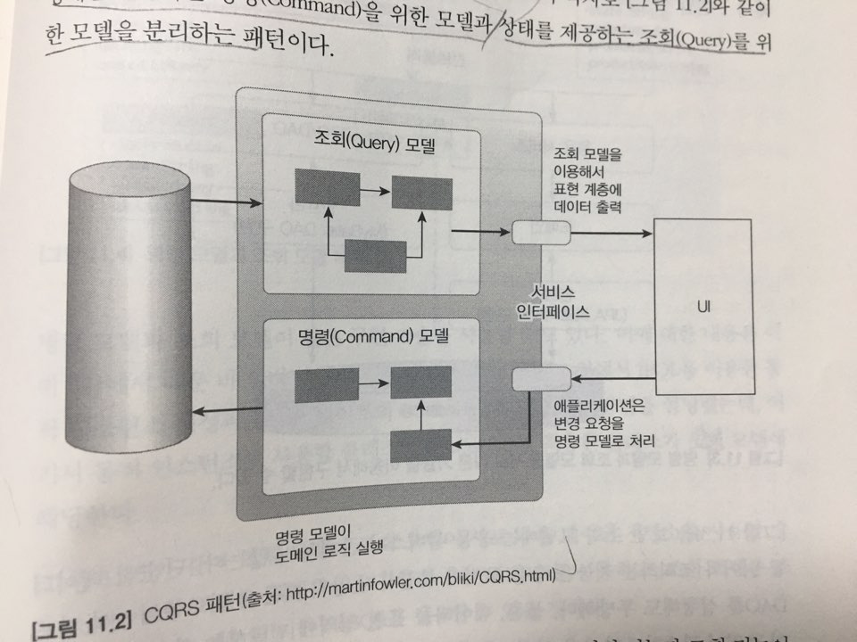

### Command Query Responsibiity Segregation

**상태를 변경하는 명령을 위한 모델과 상태를 제공하는 조회를 위한 모델을 분리하는 패턴**
- CQRS는 복잡한 도메인에 적합함. 도메인이 복잡할수록 명령(Command) 기능과 조회(Query) 기능이 다루는 데이터 범위에 차이가 발생하는데, 이 두 기능을 단일 모델로 처리하게 되면 조회 기능의 로딩 속도를 위해 모델 구현이 필요 이상으로 복잡해지는 문제가 발생함.
- 조회 모델은 Mybatis, 명령 모델은 JPA로 분리하여 서로 다른 기술을 이용 할 수 있음.

### CQRS의 장단점
- 장점
  - 명령 모델을 구현할 때 도메인 자체에 집중 할 수 있음. 조회 성능을 위한 코드가 명령 모델에 없으므로 도메인 로직을 구현하는 데 집중할 수 있음.
  - 조회 성능을 향상시키는데 유리함.Â
- 단점
  - 구현해야할 코드가 더 많고 코드의 응집성이 떨어질 수 있음.
  - 더 많은 구현 기술이 필요함. (경우에 따라 다른 저장소를 사용할 수도 있는데 이때, 데이터 동기화를 위해 메시징 시스템을 도입해야 할 수도 있음.)
