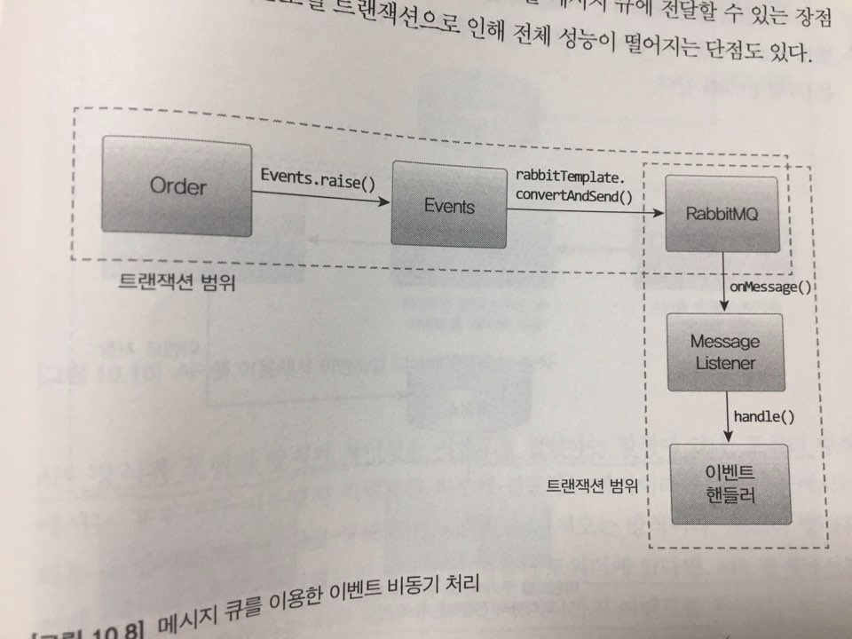

### 이벤트 기반으로 시스템 결합도 줄이기

- 이벤트란 '과거에 벌어진 어떤 것'
- 이벤트가 발생한다는 것은 상태가 변경됐다는 것을 의미

#### 이벤트 관련 구성 요소

- 이벤트 생성 주체 : Entity, Value, Domain Service etc.. 도메인 객체
- 이벤트 핸들러 : 이벤트 생성 주체가 발생한 이벤트에 반응. 이벤트 핸들러는 생성 주체가 발생한 이벤트를 전달받아 이벤트에 담긴 데이터를 이용해서 원하는 기능을 실행
- 이벤트 디스패처 : 이벤트 생성 주체와 이벤트 핸들러를 연결 해주는 어댑터. 디스패처의 구현 방식에 따라 이벤트 생성과 처리를 동기나 비동기로 실행하게됨.
- 이벤트 : 발생한 이벤트에 대한 정보를 담는 DTO 역할
  - 이벤트 종류, 발생시간, 추가 데이터(처리할 이벤트 entity의 id, 변경할 상태 값등등)

### 비동기 이벤트 처리

- **로컬 핸들러를 비동기로 실행** : 이벤트 핸들러를 별도 스레드로 실행(다른 트랜잭션이 적용됨)
- **메시지 큐를 사용** : 이벤트가 발생시 이벤트 디스패처가 이벤트를 메시지 큐에 보냄. 메시지 큐는 이벤트를 메시지 리스너에 전달하고, 메시지 리스너는 알맞은 이벤트 핸들러를 이용해서 이벤트를 처리. (이때 이벤트를 메시지 큐에 저장하는 과정과 메시지 큐에서 이벤트를 읽어와 처리하는 과정은 별도 스레드나 프로세스로 처리)

#### 이벤트 저장소를 이용한 비동기 처리

이벤트를 일단 DB에 저장한 뒤에 별도 프로그램을 이용해서 이벤트 핸들러에 전달

- **이벤트 저장소와 이벤트 포워더 사용** : 포워더는 주기적으로 이벤트 저장소에서 이벤트를 가져와 이벤트 핸들러를 실행. 포워더는 별도의 스레드를 이용하기 때문에 이벤트 발행과 처리가 비동기로 처리됨.

- **이벤트 저장소와 이벤트 제공 API 사용** : 외부 핸들러가 포워더를 이용해서 API 서버를 통해 이벤트 목록을 가져오는 방식. 포워더 방식은 이벤트를 어디까지 처리했는지 추적하는 역할이 포워더에 있다면, API방식에서는 이벤트 목록을 요구하는 외부 핸들러가 자신이 어디까지 이벤트를 처리했는지 기억해야함.

