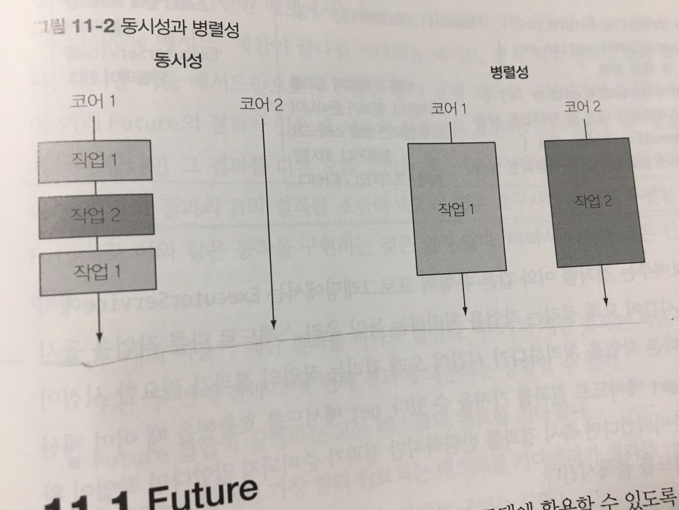

### CompletableFuture

- 병렬성과 동시성은 다르다. 병렬성은 작업을 작게 나누어 여러 스레드에서(Divide & Conquer) 처리하는 것이고, 동시성은 하나의 CPU 사용을 가장 극대화할 수 있도록 느슨하게 연관된 여러 작업을 수행하는 것이다.


- 자바 5부터는 미래의 어느시점에 결과를 얻는 모델에 활용할 수 있도록 Future 인터페이스를 제공하고 있다. 비동기 계산을 모델링하는 데 Future를 이용할 수 있으며, Future는 계산이 끝났을 때 결과에 접근할 수 있는 레퍼런스를 제공한다. 시간이 걸릴 수 있는 작업을 Future 내부로 설정하면 호출자 스레드가 결과를 기다리는 동안 다른 유용한 작업을 수행할 수 있다.

- Future와 CompletableFuture의 관계를 Collection과 Stream의 관계에 비유할 수 있다.
- 비동기 API를 다음과 같이 제공할 수 있다.
```java
public class CompletableFutureTest {

  public static Future<Long> getCountAsync() {
    CompletableFuture<Long> future = new CompletableFuture<>();
    new Thread(() -> {
      try {
        Long count = count();
        future.complete(count);
      } catch (Exception e) {
        //Exception을 핸들링하는 방법 -> 에러 발생시 ExcutionException안에 Exception을 wrapping에서 던진다.
        future.completeExceptionally(e);
      }
    }).start();

    return future;
  }

  private static long count() throws InterruptedException {
    Thread.sleep(1000)
    return 1;
  }
}
```
- 위의 코드를 선언형으로 처리한다면 다음과 같이 작성할 수 있다. 위의 코드와 아래 코드는 똑같이 작동한다.
```java
public class CompletableFutureTest {

  private static Future<Long> getCountAsync() {
    return CompletableFuture.supplyAsync(CompletableFutureTest::count);
  }

  private static long count() throws InterruptedException {
    Thread.sleep(1000)
    return 1;
  }
}
```

### CompletableFuture method
- CompletableFuture클래스안에 정의되어 있는 메서드에 대해서 알아보자.
- **public static \<U\> CompletableFuture\<U\> supplyAsync(Supplier\<U\> supplier) :** Supplier를 인수로 받아서 CompletableFuture를 반환한다. CompletableFuture는 Supplier를 실행해서 비동기적으로 결과를 생성한다. ForkJoinPool의 Executor 중 하나가 Supplier를 실행할 것이다.
- **public static \<U\> CompletableFuture\<U\> supplyAsync(Supplier\<U\> supplier, Executor executor) :** 위의 메서드를 오버로딩한 것으로 커스텀한 Executor를 전달할 수 있다. 위의 메서드에서 사용하는 ForkJoinPool은 Runtime.getRuntime().availableProcessors()를 통해 얻어온 수 만큼 스레드풀을 생성한다. 이는 현재 JVM에서 사용할 수 있는 코어수로 하이퍼스레딩까지 적용된 값을 가져온다.
> 이후에는 Executor인자는 제외한 메서드를 소개하겠다. 이하 모든 메서드는 위와 같은 방식이기 때문이다.
- **public \<U\> CompletableFuture\<U\> thenApply(Function\<? super T,? extends U\> fn) :** 람다식을 받아서 실행시킨다. static메서드가 아님에 주목하자. CompletableFuture인스턴스를 통해서 이 메서드를 호출시키면 future작업이 끝난 후 그 결과 값을 이용하여 람다식을 실행시킨다.
> Async로 끝나지 않는 메서드는 이전 작업을 수행한 스레드와 같은 스레드에서 작업을 실행함을 의미하며 Async로 끝나는 메서드는 다음 작업이 다른 스레드에서 실행되도록 스레드 풀로 작업을 제출한다. ex) thenApplyAsync(..)

**sample code**
```java
CompletableFuture
  .supplyAsync(() -> "future task")
  .thenApply(res -> {
    System.out.println(res);
    return res;
  });
```
- **public \<U\> CompletableFuture\<U\> thenCompose(Function\<? super T, ? extends CompletionStage\<U\>\> fn) :** 두 비동기 연산을 파이프라인으로 만들 수 있도록 thenCompose메서드를 제공한다. 이 메서드는 첫 번째 연산의 결과를 두 번째 연산으로 전달한다. 즉, 첫 번째 CompletableFuture에 thenCompose에 thenCompose를 호출하고 Function에 넘겨주는 식으로 두 CompletableFuture를 조합할 수 있다. Function은 CompletableFuture 반환 결과를 인수로 받고 두 번째 CompletableFuture를 반환하는데, 두 번째 CompletableFuture는 첫 번째 CompletableFuture의 결과를 계산의 입력으로 사용한다.
> CompletableFuture는 CompletionStage를 구현한다. 즉, CompletionStage의 서브타입이다.

**sample code**
```java
CompletableFuture<String> f1 = CompletableFuture
  .supplyAsync(() -> "first task")
  .thenCompose(beforeTaskRes -> CompletableFuture.supplyAsync(() -> beforeTaskRes + " second task"));

System.out.println(f1.join());
```

- **public \<U,V\> CompletableFuture\<V\> thenCombine(CompletionStage\<? extends U\> other, BiFunction\<? super T,? super U,? extends V\> fn) :** 독립적으로 실행된 두 개의 CompletableFuture 결과를 합쳐야 하는 상황이 종종 발생한다. 물론 첫 번째 CompletableFuture의 동작 완료와 관계없이 두 번째 CompletableFuture를 실행할 수 있어야한다. 이런상황에서 thenCombine을 사용한다. thenCombine는 두 번째 인자로 BiFunction을 받는다. BiFunction은 두 개의 CompletableFuture 결과를 어떻게 합칠지 정의한다. thenCombineAysnc는 BiFunction이 정의하는 조합 동작이 스레드 풀로 제출되면서 별도의 태스크에서 비동기적으로 수행된다.

**sample code**
```java
CompletableFuture<String> f2 = CompletableFuture
  .supplyAsync(() -> "other first task")
  .thenCombine(CompletableFuture.supplyAsync(() -> "other second task"), (p1, p2) -> p1 + p2 + " each other task combine");

System.out.println(f2.join());
```

- **public CompletableFuture\<Void\> thenAccept(Consumer\<? super T\> action) :** thenAccept는 연산 결과를 소비하는 Consumer를 인자로 받는다.  thenAcceptAsync는 CompletableFuture가 완료된 스레드가 아니라 새로운 스레드를 이용해서 Consumer를 실행한다. thenAccept는 CompletableFuture가 생성한 결과를 어떻게 소비할지 미리지정했으므로 CompletableFuture\<Void\>를 반환한다.

**sample code**
```java
CompletableFuture.supplyAsync(() -> "task thenAccept").thenAccept(System.out::println);
```

- **public static CompletableFuture\<Void\> allOf(CompletableFuture<?>... cfs) :** static 메서드인 allOf는 CompletableFuture 배열을 입력으로 받아 CompletableFuture\<Void\>를 반환한다. 전달된 모든 CompletableFuture가 완료되어야 CompletableFuture\<Void\>가 완료된다. 따라서 allOf가 반환하는 CompletableFuture에 join을 호출하면 CompletableFuture 배열의 모든 task를 기다릴 수 있다.

- **public static CompletableFuture\<Object\> anyOf(CompletableFuture<?>... cfs) :** static 메서드인 anyOf는 allOf와 반대로 동작한다. CompletableFuture 배열을 인자로 받은 후 이 배열의 future중 하나의 작업이 끝나길 기다린다. CompletableFuture\<Object\>는 처음으로 완료한 CompletableFuture의 값으로 동작을 완료한다.

> 스레드풀이 너무 크면 CPU와 메모리 자원을 서로 경쟁하느라 시간을 낭비할 수 있다. 반면 스레드 풀이 너무 작으면 CPU의 일부 코어는 활용되지 않을 수 있다. 자바 병렬 프로그래밍에서는 스레드 풀의 최적값을 찾는 방법을 다음과 같이 제안한다.
**Nth = Ncpu * Ucpu * (1 + W/C)**
Ncpu: Runtime.getRuntime().availableProcessors()가 반환하는 코어 수
Ucpu: 0과 1사이의 값을 갖는 CPU 활용 비율
W/C는 대기시간(CPU 대기시간)과 계산시간(CPU 사용시간)의 비율
I/O작업을 할 경우 CPU를 소모하지 않는다. DMA라는 물리장치가 직접 메모리에 로딩한 후 CPU에게 인터럽트를 줄 뿐이다. 이와 같은 메커니즘은 꽤나 훌륭한 식견을 준다.
