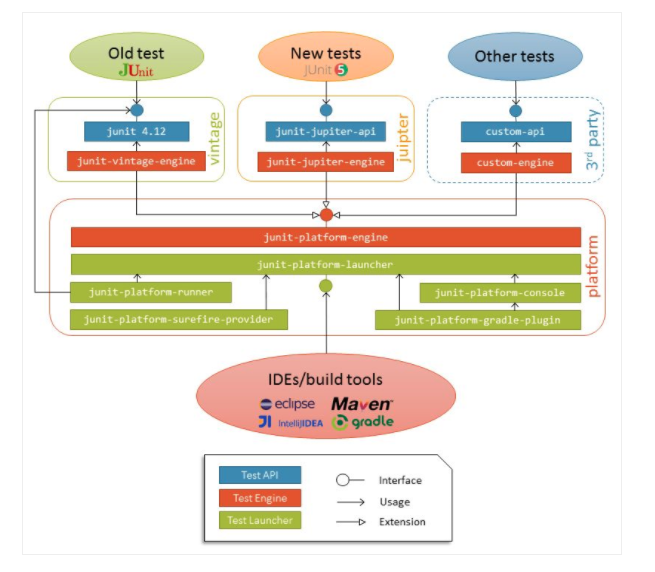

## Junit5

Junit5는 모듈화가 되어있지않은 Junit4의 문제점을 해결하기 위해 모듈화를 통해 기능을 제공하고 테스트시 java 8의 기능을 잘 활용할 수 있도록 지원해준다. Junit5는 다음과 같은 문제를 더 잘 다루게되었다.

- 실행되어야할 테스트를 discovering 해야하는 문제.
- Test API가 IDE와 여러 툴들과 더 쉽게 상호 작용해야하는 문제.
- 더 나은 Readable한 테스트 코드 작성을 위한 API 제공.

Junit5는 다음 세 가지 모듈을 제공한다.

### JUnit Platform

- 테스트가 JVM위에서 실행될 수 있도록 core한 기능을 제공
- Junit과 Junit을 사용하는 client tool (build tool, ide등)사이의 interface 제공
- 3rd party test library(Spock, Cucumber, FitNesse등등) 연동을 위한 TestEngine API 제공

### JUnit Jupiter
- Junit Platform에서 제공하는 interface의 구현체를 제공
- @AfterEach, @AfterAll, @BeforeEach @BefreAll 등 테스트를 작성할 때 사용되는 모델들을 제공

### JUnit Vintage
- Junit4, Junit3를 기반으로 작성된 테스트를 Junit5 플랫폼 위에서 실행시킬 수 있는 기능을 제공




## Junit4 vs Junit5

### Exception 검증

- junit4

```java
@Test(expected = Exception.class)
public void shouldRaiseAnException() throws Exception {
    // ...
}
```

- junit5

```java
public void shouldRaiseAnException() throws Exception {
    Assertions.assertThrows(Exception.class, () -> {
        //...
    });
}
```

### Timeout 검증

- junit4

```java
@Test(timeout = 1)
public void shouldFailBecauseTimeout() throws InterruptedException {
    Thread.sleep(10);
}
```

- junit5

```java
@Test
public void shouldFailBecauseTimeout() throws InterruptedException {
    Assertions.assertTimeout(Duration.ofMillis(1), () -> Thread.sleep(10));
}
```

### Renaming

- @Before -> @BeforeEach
- @After -> to @AfterEach
- @BeforeClass -> @BeforeAll
- @AfterClass -> @AfterAll
- @Ignore -> @Disabled

### Assert -> Assertions

assert기능을 제공하는 Assert 클래스가 Assertions 클래스로 바뀌면서 더 많은 기능을 제공

#### group assertion

```java
@Test
public void shouldAssertAllTheGroup() {
    List<Integer> list = Arrays.asList(1, 2, 4);
    Assertions.assertAll("List is not incremental",
        () -> Assertions.assertEquals(list.get(0).intValue(), 1),
        () -> Assertions.assertEquals(list.get(1).intValue(), 2),
        () -> Assertions.assertEquals(list.get(2).intValue(), 3));
}
```

#### define assertion message

```java
@Test
public void shouldFailBecauseTheNumbersAreNotEqual_lazyEvaluation() {
    Assertions.assertTrue(
      2 == 3,
      () -> "Numbers " + 2 + " and " + 3 + " are not equal!");
}
```

### Rule -> Extension

- junit4 rule

```java
public class TraceUnitTestRule implements TestRule {

    @Override
    public Statement apply(Statement base, Description description) {
        return new Statement() {
            @Override
            public void evaluate() throws Throwable {
                // Before and after an evaluation tracing here
                ...
            }
        };
    }
}

@Rule
public TraceUnitTestRule traceRuleTests = new TraceUnitTestRule();
```

- junit5 extension

```java
public class TraceUnitExtension implements AfterEachCallback, BeforeEachCallback {

    @Override
    public void beforeEach(TestExtensionContext context) throws Exception {
        // ...
    }

    @Override
    public void afterEach(TestExtensionContext context) throws Exception {
        // ...
    }
}

@ExtendWith(TraceUnitExtension.class)
public class RuleExampleTest {

    @Test
    public void whenTracingTests() {
        /*...*/
    }
}
```
