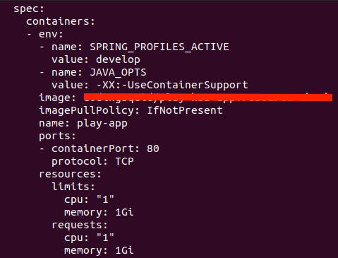
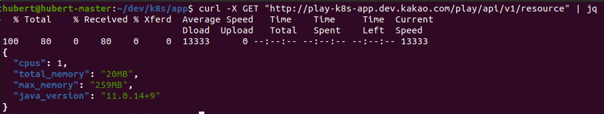
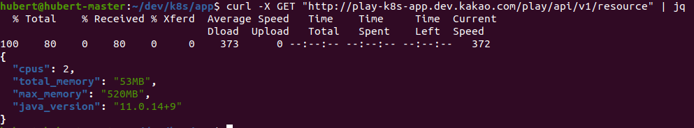
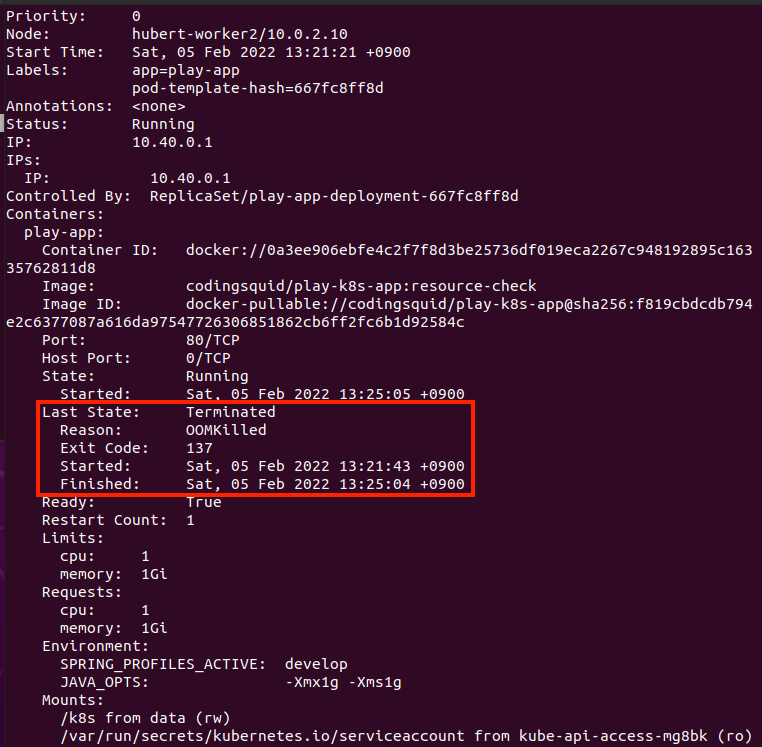
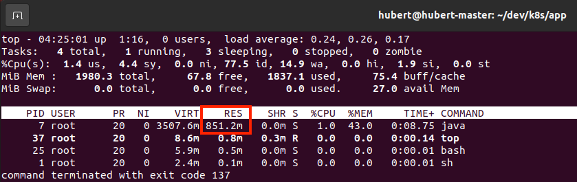

### Assign Resource (Cpu & Memory)

Pod안에서 실행되는 컨테이너가 사용하는 리소스를 제한하지 않으면 Node의 리소스를 무분별하게 사용될 수 있다. 여러 Pod이 존재한다면 Qos 클래스(BestEffort, Burstable, Guaranteed)에 따라 필요한 만큼의 리소스를 얻지 못할 수도 있다. requests, limits를 모두 설정하지 않았다면 리소스 할당 순위에서 뒤로 밀려 실행중인 Pod이 kill 당할 수도 있다. Pod에 리소스 설정을 하는 방법은 간단하다. 다음과 같이 template에 requests와 limits를 설정하면 된다.

```yaml
apiVersion: v1
kind: Pod
metadata:
  name: play-k8s-app
spec:
  containers:
  - name: play-app
    image: {image url}
    resources:
      requests:
        memory: "256Mi"
        cpu: "1"
      limits:
        memory: "256Mi"
        cpu: "1"
  - name: log-aggregator
    image: {image url}
    resources:
      requests:
        memory: "64Mi"
        cpu: "250m"
      limits:
        memory: "128Mi"
        cpu: "500m"
```

리소스 할당은 Pod에 하는 것이 아닌 Pod에서 실행되는 각 컨테이너에 할당하는 것이다. 이 점을 주의해야한다.

### 컨테이너에서 실행되는 Application에서의 리소스 정보

#### 컨테이너는 항상 컨테이너 메모리가 아닌 Node의 메모리를 본다.

Pod를 실행시킨후 Pod에서 실행되는 컨테이너의 접속하여 top 명령을 실행시키면 사용가능한 메모리양은 컨테이너가 실행 중인 노드의 전체 메모리양을 표시한다. 컨테이너에 사용 가능한 메모리의 제한을 설정하더라도 컨테이너는 이 제한을 인식하지 못한다. 이는 시스템에서 사용 가능한 메모리 양을 조회하고 해당 정보를 사용해 예약하려는 메모리 양을 결정하는 모든 애플리케이션에 좋지 않은 영향을 미친다.

### 컨테이너는 항상 컨테이너가 사용가능한 CPU 사용량이 아닌 노드의 CPU 자원을 본다.

메모리와 마찬가지로 컨테이너는 컨테이너에 설정된 CPU 제한과 상관없이 노드의 모든 CPU를 본다. CPU 제한을 1코어로 설정한다고 컨테이너에 CPU 1코어만을 노출하지 않는다. CPU 제한이 하는 일은 컨테이너가 사용할 수 있는 CPU 시간의 양을 제한하는 것이다. 64코어 CPU에 실행중인 1코어 CPU 제한의 컨테이너는 전체 CPU시간의 1/64을 얻는다. CPU 제한이 1코어로 설정되더라도 컨테이너의 프로세스는 한 개 코어에서만 실행되는 것이 아니다. 다른 시점에서 다른 코어에서 코드가 실행될 수 있다.
어떤 애플리케이션은 시스템의 CPU 수를 검색해 실행해야 할 작업 스레드 수를 결정한다. Java의 ForkJoinPool은 default로 PC의 CPU core수로 thread수를 설정한다. 코드를 보면 생성자에서 `Runtime.getRuntime().availableProcessors()`를 호출하는 것을 확인할 수 있다. 노드의 spec에 따라 값이 달라지므로 스케줄링 되는 노드에 따라 애플리케이션에 문제가 생길수도 있고 잘 동작할 수도 있다.

### 컨테이너에서 실행되는 Java Application에서 바라보는 리소스 정보

Java 8u191 버전까지는 컨테이너의 limit정보를 읽지 못해 heap size를 컨테이너에 할당된 memory 정보가 아닌 host의 memory 정보를 보고 Xmx(max heap size)값을 설정하였다. 물론 해당 값을 수동으로 주게되면 문제가 없지만, 해당 값을 별도로 설정하지 않으면 default로 Java Application이 바라보는 memory 정보의 1/4로 설정하게 된다. `Runtime.getRuntime().availableProcessors()`를 통해 읽어오는 값도 컨테이너에 할당된 cpu를 바라보는 것이 아닌 host의 cpu정보를 읽어오게된다. Java 8u191 버전 이후 즉, Java 8u192 버전 부터는 JVM이 `cgroup limits` 정보를 읽어올 수 있게되어 컨테이너에 부여된 리소스 정보를 바라보게 되었다. JVM 옵션인 `-XX:+UseContainerSupport`를 주면되고 해당 옵션은 default로 enable 되어있다. 컨테이너의 리소스 정보가 아닌 host의 리소스 정보를 보게하고 싶다면 `-XX:-UseContainerSupport`를 주면 된다. (+가 아닌 -를 주면 됨)
JVM이 컨테이너에 설정된 리소스 정보를 잘 보는지 간단하게 테스트해보겠다. spring web mvc framework를 이용하여 현재 애플리케이션의 정보를 응답으로 내려주는 API를 개발하였다. 그 후 빌드 된 jar를 이용하여 docker image를 만들어 kubernetes cluster에서 Pod로 실행시켜 테스트하였다.

- Resource Info API
```java
@RestController
public class ResourceChecker {

    private static final ResourceInfo RESOURCE_INFO = new ResourceInfo();

    @GetMapping("/api/v1/resource")
    public ResourceInfo resource() {
        return RESOURCE_INFO;
    }

    @JsonNaming(PropertyNamingStrategies.SnakeCaseStrategy.class)
    @Getter
    public static class ResourceInfo {

        private final int cpus;
        private final String totalMemory;
        private final String maxMemory;
        private final String javaVersion;

        public ResourceInfo() {
            this.cpus = Runtime.getRuntime().availableProcessors();
            this.totalMemory = toMb(Runtime.getRuntime().totalMemory()) + "MB";
            this.maxMemory = toMb(Runtime.getRuntime().maxMemory()) + "MB";
            this.javaVersion = ManagementFactory.getRuntimeMXBean().getVmVersion();
        }

        private static long toMb(long memorySize) {
            return memorySize / (1000 * 1000);
        }
    }
}
```

`-XX:[+|-]UseContainerSupport` JVM 옵션에따라 애플리케이션이 바라보는 리소스 정보를 살펴보자.
먼저 실행환경은 다음과 같다.

Worker Node Spec
- cpus: 2
- memory: 2G

Container Resource
- requests
  - cpus: 1
  - memory: 1G
- limits
    - cpus: 1
    - memory: 1G



위의 정보를 토대로 다음 결과를 해석해보자.

- `-XX:+UseContainerSupport` 옵션을 주었을 경우



- `-XX:-UseContainerSupport` 옵션을 주었을 경우



`UseContainerSupport` option을 활성화 시켰을 경우에는 jvm이 container에 설정된 리소스 정보를 바라보는 것을 cpus와 max_memory 값을 통해 확인할 수 있다. 반면에 `UseContainerSupport` option을 비활 성화 시켰을 경우에는 jvm이 container가 실행중인 host 즉, worker node의 리소스 정보를 바라보는 것을 확인할 수 있다.

### JVM Application이 실행되는 컨테이너에 메모리 제한하기
지금 까지는 `Xmx`, `Xms`값을 별도로 설정하지 않고 default값으로 주어 테스트를 진행하였다. 하지만 대부분의 운영 애플리케이션은 max heap size와 min heap size를 설정하여 실행시킨다. 그렇다면 max heap size만큼만 container가 메모리를 사용할 수 있도록 하면 될까? 다시 말하면 `-Xmx2G`로 설정하여 jvm 애플리케이션을 실행시켰다면 container의 memory limit도 2G로 설정하면 되는걸까? 정답은 '아니오'이다. 왜 아닌지 다음 테스트를 통해 살펴보자.
테스트 시나리오는 다음과 같다.

1. `Xmx1G`, `Xms1G` option을 주어 jvm의 max heap size를 1G로 설정한다.
2. container의 memory resource limit을 1G로 설정한다.
3. jvm이 heap memory를 1G만큼 사용하는지 확인한다.

위의 시나리오를 테스트하기 위해 memory usage를 증가 시키는 API를 제공하는 코드를 작성하였다.

- Increase Memory Usage API
```java
@Slf4j
@RestController
public class OutOfMemeoryExceptionTrigger {

    private static final List<Object> LIST = new ArrayList<>();

    @GetMapping("/api/v1/store")
    public String store(@RequestParam("count") int count) {
        try {
            IntStream.range(0, count)
                    .forEach(idx -> LIST.add(new Object()));
        } catch (Throwable e) {
            log.error("LIST SIZE: {}", LIST.size(), e);
        }

        return "LIST SIZE: " + LIST.size();
    }
}
```

위의 코드는 query param으로 주어지는 count 수 만큼 static 변수인 LIST에 Object를 추가하는 코드이다. static 변수는 gc 대상이 아니므로 Object가 추가 될 때마다 memory usage를 계속해서 증가 시킬 것이다.

- pod template
```yaml
...
  spec:
    containers:
    - name: play-app
      image: codingsquid/play-k8s-app:resource-check
      imagePullPolicy: IfNotPresent
      ports:
      - containerPort: 80
      resources:
        limits:
          cpu: "1"
          memory: "1Gi"
        requests:
          cpu: "1"
          memory: "1Gi"
      env:
        - name: SPRING_PROFILES_ACTIVE
          value: develop
        - name: JAVA_OPTS
          value: "-XX:+UseContainerSupport -Xmx1G -Xms1G"
...
```

위의 yaml은 pod의 일부분만 가져왔다. JAVA_OPTS를 보면 `Xmx` 값을 1G로 설정한 것을 확인할 수 있다.
위와 같은 환경으로 memory usage를 증가시키는 api를 호출하여 테스트를 진행했을 때 다음과 같은 결과를 얻을 수 있었다.
```
curl -X GET "http://play-k8s-app.dev.kakao.com/play/api/v1/store?count={count}"
```
- pod의 describe


- pod의 container에서 실행시킨 top 명령어 결과


jvm이 heap memory를 1G를 다 사용하지 않았음에도 불구하고 OOMKilled가 발생하여 Pod이 restart되었다. 당연한 결과이지만 종종 놓치는 경우가 있다. jvm이 프로세스로 실행되어 메모리에 로딩될 때 heap 영역만 있는 것이 아니다. code cache, thread stack, gc datastructure 등의 non heap 영역도 존재한다. 따라서 **container에 리소스 제한을 설정할 때 `Xmx`으로 설정된 max heap size보다 좀 더 크게 설정해주어야한다. 그렇지 않으면 jvm이 컨테이이너에 할당된 메모리보다 더 많이 사용하려고 시도하게되고 그렇게되면 Pod에 OOMKilled가 발생할 수 있다.**
