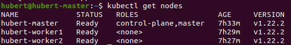

### VirtualBox를 이용하여 k8s cluster 구성

#### 환경정보
- OS: macOS Big Sur 11.5.2
- VirtualBox: 6.1.26
- Ubuntu: 20.04.3 LTS Desktop

#### VirtualBox에 Ubuntu 올리기
- 가상머신을 새로 만든 후 적절한 spec을 선택 후 다운로드 한 [ubuntu 이미지](https://ubuntu.com/download/desktop)를 설정한다.
  - memory: 2GB, 디스크: 20GB, cpu: 2개
- 네트워크를 어댑터 브리지로 설정한 후 가상 머신을 실행시킨다.
- ubuntu를 설치했다면 필요한 tool들을 설치한다.
  - `sudo apt-get update`
  - `sudo apt-get install net-tools`
  - `sudo apt-get install vim`
- 가상머신과 host 사이에 clipboard를 공유하기 위해 다음과 같은 설정을 해준다.
  - VirtualBox에서 가상머신 설정에 일반 -> 고급 -> 클립보드 공유 & 드래그 앤 드롭 -> 양방향으로 설정
  - 가상머신에서 `sudo apt-get install virtualbox-guest-x11`을 실행한다.
  - 설치가 되었다면 `VBoxClient --clipboard`를 실행한다.
  - 가상 머신에서는 `ctrl + shift + c, ctrl + shift + v`, host에서는 `command + c, command + v`를 이용하여 복사, 붙여넣기를 이용할 수 있다.

#### VirtualBox에 kubeadm 설치하기
- docs: https://kubernetes.io/ko/docs/setup/production-environment/tools/kubeadm/install-kubeadm/

1. apt 패키지 색인을 업데이트하고, 쿠버네티스 apt 리포지터리를 사용하는 데 필요한 패키지를 설치한다.
```
sudo apt-get update
sudo apt-get install -y apt-transport-https ca-certificates curl
```
2. 구글 클라우드의 공개 사이닝 키를 다운로드 한다.
```
sudo curl -fsSLo /usr/share/keyrings/kubernetes-archive-keyring.gpg https://packages.cloud.google.com/apt/doc/apt-key.gpg
```
3. 쿠버네티스 apt 리포지터리를 추가한다.
```
echo "deb [signed-by=/usr/share/keyrings/kubernetes-archive-keyring.gpg] https://apt.kubernetes.io/ kubernetes-xenial main" | sudo tee /etc/apt/sources.list.d/kubernetes.list
```
4. apt 패키지 색인을 업데이트하고, kubelet, kubeadm, kubectl을 설치하고 해당 버전을 고정한다.
```
sudo apt-get update
sudo apt-get install -y kubelet kubeadm kubectl
sudo apt-mark hold kubelet kubeadm kubectl
```

#### VirtualBox에서 kubernetes cluster 구성하기
- 위의 과정에서 생성된 가상머신을 두 개 (worker1, worker2) 복제한다.
1. MAC 주소 정책을 `모든 네트워크 어댑터의 새 MAC 주소 생성`으로 선택해야한다. 그렇지 않으면 ip가 master와 같게 설정되어 네트워크 연결이 되지 않는다. (ip 부여는 MAC주소와 연관되기 때문)


2. 완전한 복제를 선택하여 복제를 진행한다.


3. 구성된 vm들은 다음과 같다.


4. hostname을 모두 각 host의 맞게 변경한 후 reboot한다.
  - `sudo vim /etc/hostname`
5. 도구를 클릭하고 환경 설정 버튼을 클릭한 후 네트워크 탭을 누른다.
6. 새 NAT 네트워크 생성을 통해 네트워크를 생성한다.
7. 각각의 vm들 (k8s-master, k8s-worker1, k8s-worker2, k8s-worker3)의 설정을 열어 네트워크를 클릭하고 어댑터1의 속성을 아래와 같이 변경한다.


8. 각각의 vm들을 실행한 후 터미널에 ifconfig or ip addr을 입력하면 ip가 설정되어있다. vm에서 해당 ip로 ping을 날려 정상적으로 수행되는지 확인한다.

9. virtualbox를 이용한 k8s 클러스터의 구성은 다음과 같다고 볼 수 있다.


#### kubernetes 노드 추가
1. 각 vm에서 다음과 같이 터미널로 swap 기능을 꺼준다.
```
sudo -i
swapoff -a
sed -i '/ swap / s/^\(.*\)$/#\1/g' /etc/fstab
```
2. kubeadm init 실행한다.
  - 이때 결과로 `kubeadm join <Kubernetes API Server:PORT> --token <Token 값> --discovery-token-ca-cert-hash sha256:<Hash 값>`이 출력된다. worker 노드를 cluster에 join할 때 사용해야하므로 잘 저장해둔다.
  - kubeadm init 실행 후 다음과 같은 에러가 발생할 수 있다.
  ```
  [kubelet-check] It seems like the kubelet isn't running or healthy.
  [kubelet-check] The HTTP call equal to 'curl -sSL http://localhost:10248/healthz' failed with error: Get http://localhost:10248/healthz: dial tcp 127.0.0.1:10248: connect: connection refused.
  [kubelet-check] It seems like the kubelet isn't running or healthy.
  [kubelet-check] The HTTP call equal to 'curl -sSL http://localhost:10248/healthz' failed with error: Get http://localhost:10248/healthz: dial tcp 127.0.0.1:10248: connect: connection refused.
  [kubelet-check] It seems like the kubelet isn't running or healthy.
  [kubelet-check] The HTTP call equal to 'curl -sSL http://localhost:10248/healthz' failed with error: Get http://localhost:10248/healthz: dial tcp 127.0.0.1:10248: connect: connection refused.
  [kubelet-check] It seems like the kubelet isn't running or healthy.
  [kubelet-check] The HTTP call equal to 'curl -sSL http://localhost:10248/healthz' failed with error: Get http://localhost:10248/healthz: dial tcp 127.0.0.1:10248: connect: connection refused.
  [kubelet-check] It seems like the kubelet isn't running or healthy.
  [kubelet-check] The HTTP call equal to 'curl -sSL http://localhost:10248/healthz' failed with error: Get http://localhost:10248/healthz: dial tcp 127.0.0.1:10248: connect: connection refused.
  Unfortunately, an error has occurred:
              timed out waiting for the condition
  This error is likely caused by:
              - The kubelet is not running
              - The kubelet is unhealthy due to a misconfiguration of the node in some way (required cgroups disabled)
              - No internet connection is available so the kubelet cannot pull or find the following control plane images:
                  - k8s.gcr.io/kube-apiserver-amd64:v1.11.2
                  - k8s.gcr.io/kube-controller-manager-amd64:v1.11.2
                  - k8s.gcr.io/kube-scheduler-amd64:v1.11.2
                  - k8s.gcr.io/etcd-amd64:3.2.18
                  - You can check or miligate this in beforehand with "kubeadm config images pull" to make sure the images
                    are downloaded locally and cached.

          If you are on a systemd-powered system, you can try to troubleshoot the error with the following commands:
              - 'systemctl status kubelet'
              - 'journalctl -xeu kubelet'

          Additionally, a control plane component may have crashed or exited when started by the container runtime.
          To troubleshoot, list all containers using your preferred container runtimes CLI, e.g. docker.
          Here is one example how you may list all Kubernetes containers running in docker:
              - 'docker ps -a | grep kube | grep -v pause'
              Once you have found the failing container, you can inspect its logs with:
              - 'docker logs CONTAINERID'
  couldn't initialize a Kubernetes cluster
  ```
  그럼 다음과 같이 /etc/docker/daemon.json을 추가해 준 후 systemctl을 이용하여 service를 재시작한다.
  ```
  {
      "exec-opts": ["native.cgroupdriver=systemd"]
  }
  ```
  ```
  systemctl daemon-reload
  systemctl restart docker
  systemctl restart kubelet
  ```
참고: https://stackoverflow.com/questions/52119985/kubeadm-init-shows-kubelet-isnt-running-or-healthy
3. `kubectl get node`를 입력시 master 노드가 NotReady 상태로 보여지는것을 확인 할 수 있다.
  - kubectl은 .kube/config 파일을 보고 실행된다. 이 파일이 없다면 `The connection to the server localhost:8080 was refused - did you specify the right host or port?`에러가 발생 할 수 있다. 해당 에러가 발생한다면 다음과 같은 조치를 취해준다.
  ```
  mkdir -p $HOME/.kube
  sudo cp -i /etc/kubernetes/admin.conf $HOME/.kube/config
  sudo chown $(id -u):$(id -g) $HOME/.kube/config
  ```
4. worker노드로 사용할 vm에 접속하여 `kubeadm init`결과로 출력된 `kubeadm join <Kubernetes API Server:PORT> --token <Token 값> --discovery-token-ca-cert-hash sha256:<Hash 값>`을 실행하여 준다.
5. master vm으로 돌아와 `kubectl get node`를 입력하면 다음과 같은 결과를 볼 수 있다.



#### 구성된 kubernetes cluster에 간단한 nginx pod 실행하기
- nginx-deployment.yaml
```
apiVersion: apps/v1
kind: Deployment
metadata:
  name: nginx-deployment
  labels:
    app: nginx
spec:
  replicas: 3
  selector:
    matchLabels:
      app: nginx
  template:
    metadata:
      labels:
        app: nginx
    spec:
      containers:
      - name: nginx
        image: nginx:1.7.9
        ports:
        - containerPort: 80
```
- nginx-service.yaml
```
apiVersion: v1
kind: Service
metadata:
  name: nginx
  labels:
    app: nginx
spec:
  ports:
  - port: 80
    protocol: TCP
  selector:
    app: nginx
```
위의 템플릿을 작성한 후 아래 명령어를 통해 deployment와 서비스를 배포한다.
```
kubectl apply -f ./nginx-deployment.yaml
kubectl apply -f ./nginx-service.yaml
```


`kubectl get pods -o wide --sort-by="{.spec.nodeName}"`를 터미널에 입력하면 각 worker에 pod 배포된것을 확인할 수 있다.


`kubectl describe svc`를 터미널에 입력하면 접속 가능한 Endpoints들이 있는데 해당 Endpoints를 브라우저에 입력하면 nginx에서 응답해주는 화면도 볼 수 있을 것이다.


