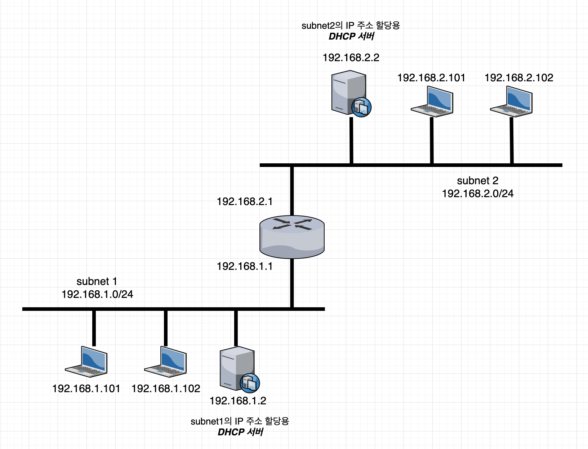

### DHCP(Dynamic Host Configuration Protocol)

#### DHCP 기초

DHCP의 기본적인 역할은 `IP 주소 할당`이다. 하지만 단순히 `192.168.0.101`과 같은 IP 주소를 PC에 할당해 봐야 네트워크는 통신할 수 없다. 일반적으로 DHCP 서버는 IP주소, 서브넷 마스크, 디폴트 게이트웨이라는 기본 3종 세트와 DNS(Domain Name Service)서버 IP 주소, 도메인 이름 같은 추가 정보를 제공한다.

기본 3종 세트에 대해 간단히 설명하면 다음과 같다.

**그림 1-1**

1. IP 네트워크는 위의 그림과 같이 복수의 서브넷이 라우터로 서로 연결되는 구조이다. 각 서브넷에는 `네트워크 주소`와 `서브넷 마스크`가 할당되고, 할당된 정보로 그 서브넷에서 이용할 수 있는 IP주소의 범위가 정해진다.

> ip address / subnet mask -> 192.168.1.0/255.255.255.0인 서브넷에서는 `192.168.1.1 ~ 192.168.1.254`가 기기에 할당할 수 있는 IP주소가 된다.

2. 서브넷1의 pc가 서브넷2에 패킷을 전송할 때는 일단 라우터의 IP 주소 `192.168.1.1`에 패킷을 보낸 다음, 이후의 배송 처리는 라우터가 처리한다. 이처럼 다른 서브넷에 패킷을 전송할 때 사용하는 라우터 IP 주소가 `디폴트 게이트웨이`이다.

> PC가 패킷을 전송할 때는 자신의 IP 주소와 서브넷 마스크를 바탕으로 목적지 IP 주소가 자신과 같은 서브넷인지 판단한다. 같은 서브넷이라면 상대편 기기에 직접 패킷을 전송하고, 다른 서브넷이라면 라우터의 IP 주소로 패킷을 보낸다.

#### DHCP 동작 원리

DHCP로 IP 주소를 할당할 때, DHCP클라이언트와 DHCP서버는 UDP(User Datagram Protocol)패킷으로 표 1-1의 4가지 메시지를 주고 받는다. DHCP서버와 DHCP클라이언트는 각각 UDP 포트 67과 68로 패킷을 수신한다.

**표 1-1 DHCP의 주요 메시지**

| 메시지 이름 | 보낸 곳 | 설명 |
|:--------:|:-----:|:---:|
| DHCP-DISCOVER | 클라이언트 | DHCP 서버를 찾아서 IP 주소할 당을 요청 |
| DHCP-OFFER | 서버 | 할당 후보 IP 주소를 제시 |
| DHCP-REQUEST | 클라이언트 | 후보로 제시된 IP 주소 사용을 요청. 혹은 IP 주소의 유효 기한 연장을 요청 |
| DHCP-ACK | 서버 | 클라이언트의 요청을 받아들임 |

그림 1-1에서 서브넷1의 PC가 주소 `192.168.1.2`인 DHCP 서버와 패킷을 주고받는다고 생각해보자. 일반적으로 UDP 통신 패킷에는 헤더 부분에 `출발지/목적지 MAC주소`, `출발지/목적지 IP 주소`, `출발지/목적지 포트 번호` 정보가 부가된다.

- DHCP-DISCOVER
  - 출발지인 DHCP 클라이언트는 아직 IP 주소를 가지고 있지 않으므로, 출발지 IP주소에는 편의상 `0.0.0.0`이 들어간다. 그리고 목적지 MAC주소와 목적지 IP주소에는 `FFFF.FFFF.FFFF`와 `255.255.255.255`가 설정되어 있다. 이들은 모두 `브로드캐스트 주소`로 불린다. 일반적으로 같은 서브넷의 기기는 스위칭 허브등 `L2 스위치`에 연결된다. L2 스위치는 목적지 MAC주소가 브로드캐스트 주소인 패킷은 모든 포트에서 같은 패킷을 내보내서, 서브넷 내의 모든 기기에 패킷이 도달하게 되어있다. L2 스위치로부터 패킷을 전달받은 기기는 목적지 IP주소를 자신의 주소와 비교해서 자신에게 온 패킷만 받아들인다. 하지만, 이번에는 목적지 IP주소도 브로드캐스트 주소로 되어 있어, 실제 IP주소와는 관계없이 모든 기기가 수신하기로 약속되어 있다. **결과적으로 DHCP-DISCOVER 패킷은 같은 서브넷의 모든 기기가 수신한다.** 단, 목적지 포트 번호 **67**에서 UDP패킷을 기다리는 것은 DHCP 서버뿐이므로 실제로 패킷을 받아 처리하는 것은 DHCP 서버이다.
  - 메시지 본문에는 누구의 요청인지 알 수 있도록 DHCP클라이언트의 MAC주소 정보가 들어있다.
- DHCP-OFFER
  - DHCP-DISCOVER 메시지를 받은 DHCP서버는 자신의 `IP 주소 관리대장`에서 미사용 IP주소를 찾아 그중 하나를 `할당 후보 IP주소`로 DHCP클라이언트에 응답한다.
  - 메시지 본문 안에는 서브넷 마스크와 디폴트 게이트웨이 정보, DHCP서버 자신의 IP주소 등도 포함된다.
- DHCP-REQUEST
  - DHCP클라이언트는 다시 브로드캐스트 주소를 이용하여 DHCP-REQUEST를 DHCP서버에 보낸다.
  - 메시지 본문 안에는 후보로 받은 IP주소와 DHCP서버의 IP 주소가 포함되어 있다.
  - "DHCP서버에게 이 IP 주소를 사용한다"고 선언하는 의미의 메시지이다.
- DHCP-ACK
  - 수신확인을 나타내는 메시지를 DHCP클라이언트에게 응답한다.
  - 자신의 `IP 주소 관리 대장`에 해당 IP주소를 "사용 중"으로 기록함과 동시에 어느 클라이언트가 사용하는지 알 수 있게 클라이언트의 MAC주소도 함께 기록한다.

DHCP-REQUEST와 DHCP-ACK Negotiation은 불필요해 보일 수 있다. 하지만 이 Negotiation은 두 가지 역할을 한다.

1. 서브넷에 복수의 DHCP 서버가 있는 상황에 대처한다. 최초의 DHCP-DISCOVER는 브로드캐스트로 송신되므로, 모든 DHCP서버가 이 메시지를 받고 DHCP-OFFER를 보낸다. 이런 경우, DHCP클라이언트는 첨음에 받은 DHCP-OFFER의 IP 주소를 채용하고 DHCP-REQUEST를 송신한다. DHCP-REQUEST 메시지에는 DHCP서버의 IP 주소가 포함되어 있으므로, 해당 DHCP 서버만 `IP 주소 관리 대장`을 갱신한다. 나머지 DHCP서버는 자신들이 후보로 제시한 IP 주소는 채용되지 않은 것으로 보고 미사용 상태인 채로 둔다. **실제로는 사용되지 않는 IP 주소를 사용상태로 기록하는 것을 방지한다.**
2. IP 주소의 재할당 처리에 관계한다. DHCP서버가 클라이언트에게 할당한 IP 주소에는 유효기간이 있다. 유효기한을 넘긴 IP주소에 대해서는 DHCP서버는 `IP 주소 관리 대장`의 기록을 미사용 상태로 되돌린다. 클라이언트가 정지한 후, 그 IP 주소의 기록이 사용중인 채로 남아있지 않게 하려는 구조다. 하지만 유효기한이 만료된 IP 주소를 계속 사용하고 싶을 때도 있다. 그런 경우, DHCP클라이언트는 유효기한이 다하기 전에 DHCP-REQUEST를 보내고 DHCP서버로부터 DHCP-ACK를 수신한다. DHCP 서버는 해당 IP 주소를 다시 할당한 것으로 인식하고 유효기한을 연장한다. **DHCP클라이언트는 유효기한이 끝나길 기다렸다가 DHCP-DISCOVER부터 다시 시작 할 필요가 없다.**

**표 1-1 DHCP의 그 밖의 메시지**

| 메시지 이름 | 보낸 곳 | 설명 |
|:--------:|:-----:|:---:|
| DHCP-RELEASE | 클라이언트 | IP 주소 해제 통지 |
| DHCP-NAK | 서버 | 클라이언트의 요청 거부 |
| DHCP-INFORM | 클라이언트 | IP주소 이회의 설정 정보 요청 |

PC정지 중에 할당된 IP의 유효기한이 지난 경우는 DHCP서버 쪽에서 해당 IP주소를 미사용 상태로 되돌린다. 이때 PC가 DHCP-REQUEST를 송신한 경우, DHCP서버는 DHCP-NAK을 응답하고 유효기한 연장을 거부한다. 클라이언트는 DHCP-DISCOVER부터 다시 시작해 새로운 IP주소를 할당 받는다.
