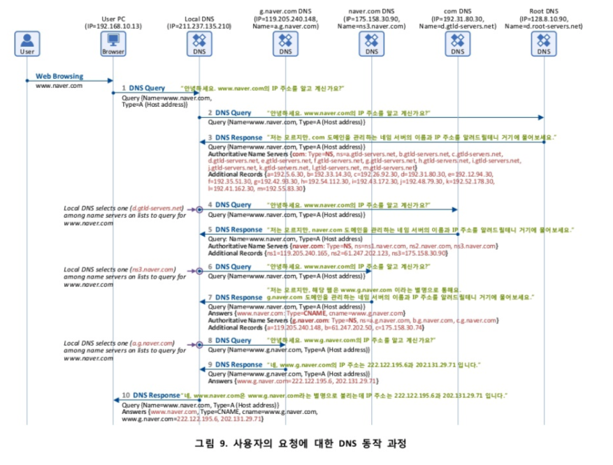

### DNS (Domain Name System)

- 인터넷을 이용하여 검색이나 웹 서핑, 이메일 등의 웹 애플리케이션을 사용할 때 사용자는 도메인 이름을 웹 브라우저의 주소 창에 입력하고 해당 데이터를 요청한다. 즉, 실제 웹 브라우저와 웹 서버는 숫자로 구성된 IP 주소로 통신하지만 사용자는 기억하기 쉬운 도메인 이름을 사용하는 것이다.이와 같이 사용자가 입력한 도메인 주소를 IP 주소로 변환 하는 과정이 필요한데, 이를 담당하는 시스템이 DNS(Domain Name System)이다.

#### DNS의 구성 요소

- **도메인 네임 스페이스 (Domain Name Space)**
    - DNS는 거대한 분산 네이밍 시스템이며, 도메인 네임 스페이스는 이러한 DNS가 저장/관리하는 계층적 구조를 의미한다.
    - 최상위 Root DNS 서버가 존재하고, 그 하위로 인터넷에 연결된 모든 노드가 연속해서 이어진 계층 구조로 구성되어 있다. 각 레벨(Top level, Second level등)의 도메인은 그 하위 도메인에 관한 정보를 관리하는 구조이다.

- **네임 서버 (Name Server)**
    - 문자열로 표현된 도메인 이름을 실제 컴퓨터가 통신할 때 사용하는 숫자로 표현된 IP 주소로 변환하는 시켜주어야한다. 이러한 동작을 위해서는 도메인 네임 스페이스의 트리 구조에 대한 정보가 필요하며, 이러한 정보를 가지고 있는 서버를 네임 서버라고 한다. 즉, 도메인 이름을 IP 주소로 변환하는 것을 네임 서비스라고 하며 리졸버(Resolver)로 부터 요청 받은 도메인 이름에 대한 IP정보를 다시 리졸버로 전달해주는 역할을 수행하는 것이 네임 서버이다.

- **리졸버 (Resolver)**
    - 리졸버는 웹 브라우저와 같은 DNS 클라이언트의 요청을 네임 서버로 전달하고 네임 서버로부터 정보(도메인 이름과 IP 주소)를 받아 클라이언트에게 제공하는 기능을 수행한다. 이 과정에서 리졸버는 하나의 네임 서버에게 DNS 요청을 전달하고 해당 서버에 정보가 없으면 다른 네임 서버에게 요청을 보내 정보를 받아 온다.

#### DNS 기본 동작 과정
- 사용자가 요청한 도메인의 IP 주소는 Local DNS 서버가 다른 DNS 서버와 통신하여 사용자에게 제공한다. 즉, Local DNS 서버는 사용자의 요청을 대신하여 해당 도메인의 IP 주소 정보를 획득할 때까지 필요에 따라 여러 DNS 서버와의 통신을 수행하고(Recursion, 재귀적 통신), 해당 정보를 획득한 후 사용자에게 그 결과 값을 전달한다. (Local DNS 서버에 캐쉬되어 있는 경우에는 다른 DNS 서버와의 연동 없이 바로 사용자에게 결과 값을 전달한다.) 다음은 실제 웹 브라우저에서 URL을 입력하여 요청 했을 경우 동작되는 Flow다.

> 위의 그림에서 naver.com DNS 서버에서 www.naver.com이 도메인 이름이 www.g.naver.com라는 별칭으로 사용된다는 CNAME 정보와 자신이 관리하는 하위 레벨의 네임 서버들 가운데 g.naver.com 도메인을 관리하는 네임 서버들의 정보를 DNS Response 메시지에 담아 보내는 7번 단계를 주의 깊게 보면 좋을 것 같다. GSLB적용 시 CNAME 정보가 이용되기 때문이다.

참고 : [DNS 동작원리 참고 자료](https://www.netmanias.com/ko/post/techdocs/5259/dns-network-protocol/dns-basic-operation)
