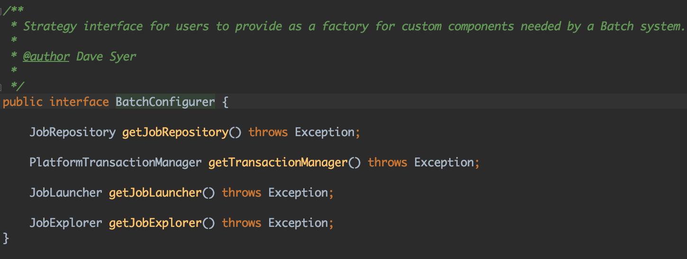
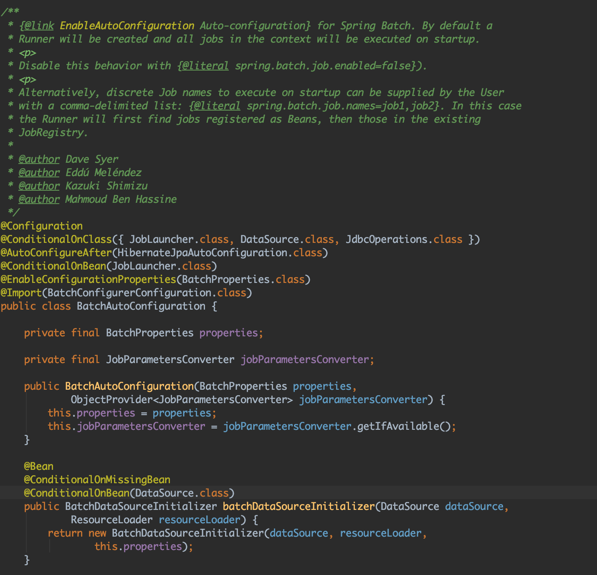
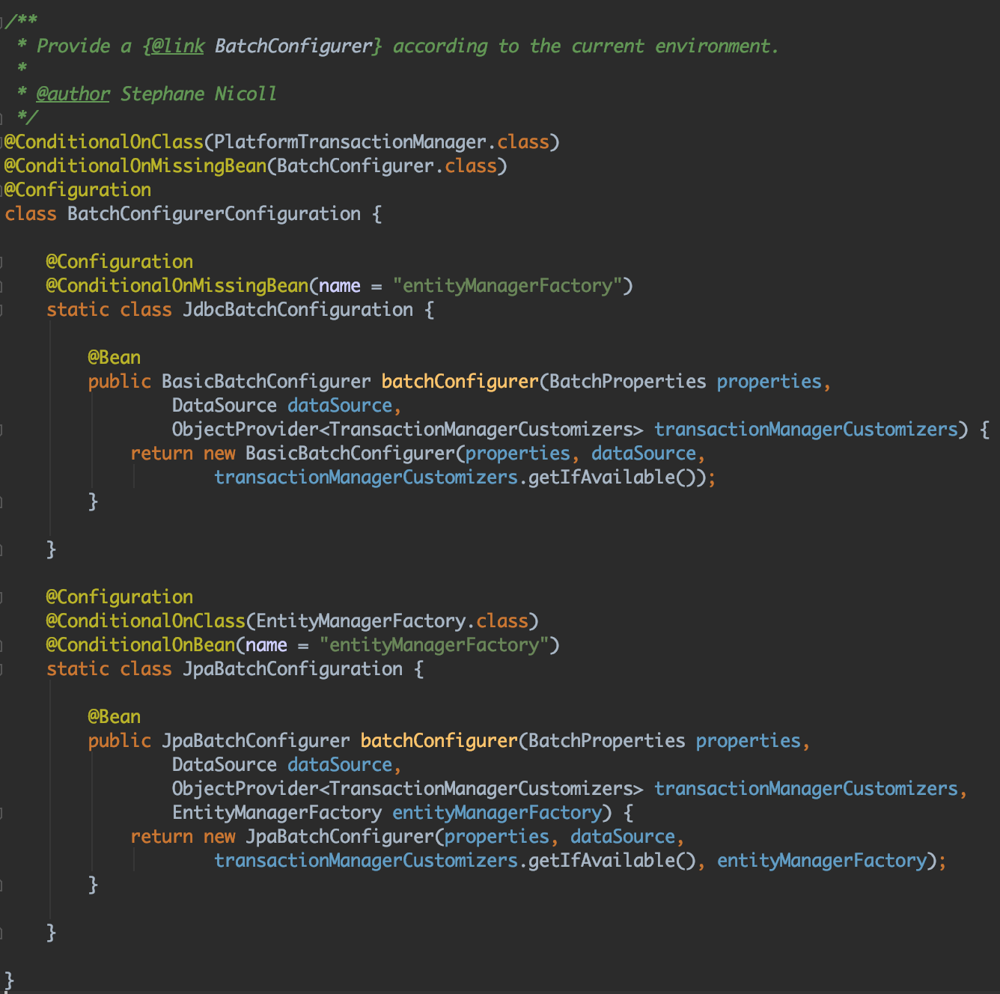
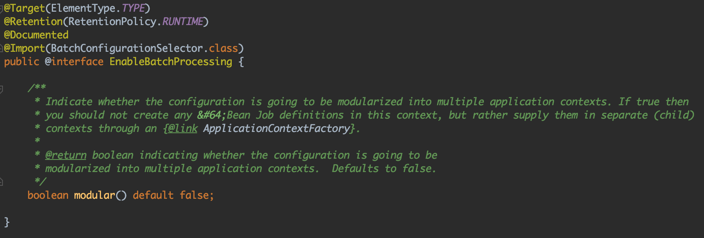
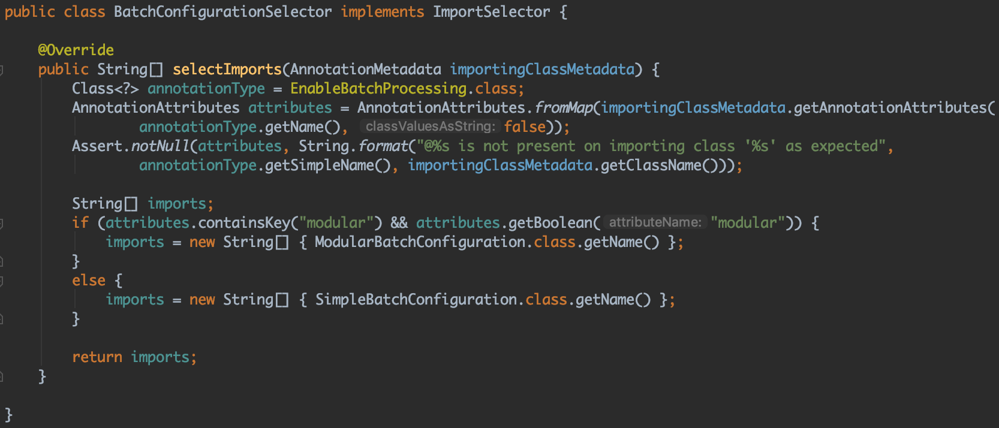
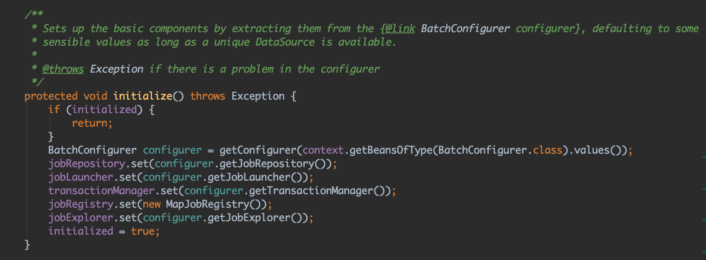
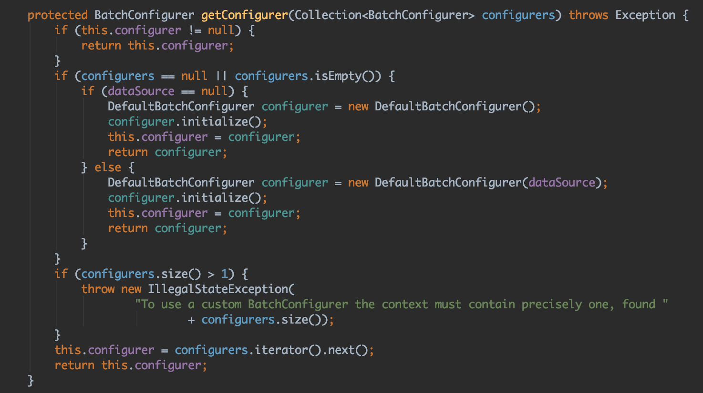

### Batch Schema를 비즈니스에서 사용하는 DB와 분리하기
- 배치 어플리케이션에서 관리하는 테이블들을 비즈니스에서 사용하는 DB와 분리해야하는 문제를 해결해야 할 경우 다음과 같이 해결 할 수 있다.

```kotlin
@Configuration
@EnableBatchProcessing
class BatchConfig {

    companion object {
        private val log: Logger = LoggerFactory.getLogger(BatchConfig::class.java)
    }

    @Bean
    fun batchConfigurer(hedwigBatchMetaMasterDBProperties: HedwigBatchMetaMasterDBProperties, hedwigBatchMetaSlaveDBProperties: HedwigBatchMetaSlaveDBProperties): BatchConfigurer {
        return DefaultBatchConfigurer(batchMetaManageDatasource(hedwigBatchMetaMasterDBProperties, hedwigBatchMetaSlaveDBProperties))
    }

    fun batchMetaManageDatasource(hedwigBatchMetaMasterDBProperties: HedwigBatchMetaMasterDBProperties, hedwigBatchMetaSlaveDBProperties: HedwigBatchMetaSlaveDBProperties): DataSource {
        val master = configureDataSource(hedwigBatchMetaMasterDBProperties)
        val slave = configureDataSource(hedwigBatchMetaSlaveDBProperties)

        val routingDataSource = ReplicationRoutingDataSource()

        val dataSourceMap: Map<Any, Any> = mapOf("hedwigBatchMetaMaster" to master, "hedwigBatchMetaSlave" to slave)

        routingDataSource.setTargetDataSources(dataSourceMap)
        routingDataSource.setDefaultTargetDataSource(slave)
        routingDataSource.afterPropertiesSet()

        return LazyConnectionDataSourceProxy(routingDataSource)
    }

    private fun configureDataSource(databaseProperties: DatabaseProperties): DataSource {
        val dataSource = HikariDataSource()

        if (databaseProperties.readOnly.toBoolean()) {
            dataSource.poolName = "HikariPool-hedwig-batch-meta-slave"
        } else {
            dataSource.poolName = "HikariPool-hedwig-batch-meta-master"
        }

        dataSource.connectionTestQuery = "select 1"
        dataSource.isReadOnly = databaseProperties.readOnly.toBoolean()
        dataSource.driverClassName = databaseProperties.driverClassName
        dataSource.jdbcUrl = databaseProperties.url
        dataSource.username = databaseProperties.userName
        dataSource.password = databaseProperties.password
        dataSource.maximumPoolSize = databaseProperties.maximumPoolSize.toInt()
        dataSource.minimumIdle = databaseProperties.minimumIdle.toInt()

        dataSource.addDataSourceProperty("cachePrepStmts", "true")
        dataSource.addDataSourceProperty("prepStmtCacheSize", "250")
        dataSource.addDataSourceProperty("prepStmtCacheSqlLimit", "2048")

        return dataSource
    }

    class ReplicationRoutingDataSource : AbstractRoutingDataSource() {

        override fun determineCurrentLookupKey(): Any? {
            if (TransactionSynchronizationManager.isCurrentTransactionReadOnly()) {
                log.debug("hedwigBatchMetaTransaction is slave!")
                return "hedwigBatchMetaSlave"
            }

            log.debug("hedwigBatchMetaTransaction is master!")
            return "hedwigBatchMetaMaster"
        }
    }
}
```

위의 코드 중 다음 코드를 살펴보자.
```kotlin
...
    @Bean
    fun batchConfigurer(hedwigBatchMetaMasterDBProperties: HedwigBatchMetaMasterDBProperties, hedwigBatchMetaSlaveDBProperties: HedwigBatchMetaSlaveDBProperties): BatchConfigurer {
        return DefaultBatchConfigurer(batchMetaManageDatasource(hedwigBatchMetaMasterDBProperties, hedwigBatchMetaSlaveDBProperties))
    }
...
```
Datasource를 DefaultBatchConfigurer생성자에 주입함으로써 DB를 분리할 수 있다. 그러면 여기서 DefaultBatchConfigurer가 뭔지 궁금할 것이다. 이것을 한 번 뜯어보자.

위의 BatchConfigurer 배치 설정을 위한 인터페이스이다. DefaultBatchConfigurer는 BatchConfigurer인터페이스의 구현체 중 하나이다. 그럼 SpringBoot에서 제공하는 BatchAutoConfiguration을 살펴보자.

```java
@Import(BatchConfigurerConfiguration.class)
```
위의 클래스를 따라가보자.

위의 코드를 보면 @ConditionalOnMissingBean(BatchConfigurer.class)애너테이션ㅇ이 붙어있다. 즉, BatchConfigurer타입의 Bean이 없으면 위의 설정들을 적용하는 것이다. 코드를 보면 알수있듯이 entityManagerFactory bean이 없으면 BasicBatchConfigurer를 entityManagerFactory bean이 있으면 JpaBatchConfiguration 만들어서 사용한다. 여기서 의문점이 생긴다. 그럼 DefaultBatchConfigurer는 무엇인가. @EnableBatchProcessing에 답이있다.

```java
@Import(BatchConfigurationSelector.class)
```
이 클래스를 따라가보자.

@EnableBatchProcessing 별다른 옵션을 주지않으면 SimpleBatchCongifuration.class를 빈으로 띄운다. SimpleBatchCongifuration 클래스안의 다음 메서드를 주목하자.

initialize라는 메서드가있고 이안에서 BatchConfigurer를 생성한다. getConfigurer는 SimpleBatchCongifuration의 부모클래스인 AbstractBatchConfiguration의 메서드이다. 이 클래스의 getConfigurer메서드를 살펴보자.

이 메서드를 보면 DefaultBatchConfigurer를 생성하여 BatchConfigurer빈을 띄우는 것을 확인할 수 있다. 기존의 DataSource Bean이 있다면 그 빈을 사용하게 될것이고 생성자에 별도의 DataSource를 주 입하면 그 DataSource를 이용하게된다. 즉, @EnableBatchProcessing은 BatchConfigurer빈이 없다면 이를 생성해서 빈으로 등록해주는데 이때 DefaultBatchConfigurer를 생성해서 주입해주는 것이다. 따라서 DefaultBatchConfigurer빈을 생성해놓으면 이것을 사용하게된다. Batch 스키마를 분리하고 싶은 DB의 DataSource를 세팅하고 그것을 주입해주기만하면 된다.
