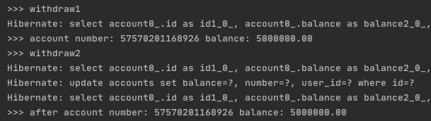

### JPA Entity 조건
- JPA의 Entity의 기본생성자가 있어야하며 접근제어자가 public이거나 protected이어야 함.

### JPA 양방향 관계 설정 시 주의사항
- entity간의 양방향 관계 설정 시 무한참조가 걸릴 수 있음. (특히 toString 함수를 이용할 때 조심해야함.)

### JPQL query 이용 시 이슈
- 모빌리티에서는 각 datasource마다 query팩토리를 만들어서 사용 중

### ddl 속성
- spring.jpa.generate-ddl 속성은 spring.jpa.hibernate.ddl-auto속성에 의해 재정의됨.

### deleteById를 통해 데이터를 삭제할 경우
- CrudRepository의 deleteById메서드를 구현한 구현체를 보자
```java
@Transactional
public void deleteById(ID id) {

  Assert.notNull(id, ID_MUST_NOT_BE_NULL);

  delete(findById(id).orElseThrow(() -> new EmptyResultDataAccessException(
    String.format("No %s entity with id %s exists!", entityInformation.getJavaType(), id), 1)));
}
```
- 위 코드를 보면 findById(id)를 통해 entity를 가져온 후 delete를 하게된다. delete from 절을 이용하여 바로 삭제하면 될 것을 굳이 select query를 소모한 후에 delete를 하게된다. 이를 해결하려면 Querydsl을 이용하여 delete쿼리를 바로 보내면 된다.
```java
public class BookMarkCustomRepositoryImpl extends QuerydslRepositorySupport implements BookMarkCustomRepository {

    private static final QBookMark bookMark = QBookMark.bookMark;
    private static final QTraveler traveler = QTraveler.traveler;
    private static final QPlayLand playLand = QPlayLand.playLand;

    @PersistenceContext
    private EntityManager entityManager;

    public BookMarkCustomRepositoryImpl() {
        super(BookMark.class);
    }

    @Override
    public List<BookMark> findBookMarkListByTravelerId(Long travelerId) {
        JPQLQuery<BookMark> query = from(bookMark)
                .innerJoin(bookMark.playLand, playLand)
                .innerJoin(playLand.traveler, traveler)
                .fetchJoin()
                .where(bookMark.traveler.id.eq(travelerId));

        return query.fetch();
    }

    @Transactional
    @Override
    public void customDeleteById(Long id) {
        JPAQueryFactory queryFactory = new JPAQueryFactory(entityManager);

        queryFactory.delete(bookMark)
                .where(bookMark.id.eq(id))
                .execute();
    }
}
```
- 위의 코드에서 customDeleteById(Long id)메서드를 보면 별다른 설명없이 이해가 가능하다.

### @ManyToOne
- optional=false 옵션을 주면 inner join, true를 주면 left outer join을 날린다.
- 양방향 관계로 설정시 fetchType이 Eager여서 join문을 날리지만 실질적으로 get할때 select 쿼리를 한번 더 날린다. @OneToMany관계에서 one쪽의 list를 채우기 위함이다.

### JPQL로 Insert, Update나 Delete쿼리를 사용할 경우
- 데이터베이스로 바로 질의 하기 때문에 영속성 컨텍스트와 데이터베이스 Sync가 깨진다. 따라서 entityManager.refresh()를 해주거나 clear()를 통해 영속성컨텍스트를 관리해주어야한다.

### JPQL로 Select쿼리를 사용할 경우
- 영속성 컨텍스트를 건너띄고 바로 데이터베이스로 질의한다. Entity를 가져왔는데 영속성 컨텍스트에 해당 Entity가 존재한다면 가져온 데이터를 버리고 영속성 컨텍스트의 데이터를 이용한다.

### JPQL로 Join 쿼리를 사용할 경우
- ManyToOne관계인 Member Entity와 Team Entity가 있다고 가정해보자. (JPQL은 반드시 별칭을 사용해야한다.)
```sql
SELECT m FROM Member m JOIN m.team t WHERE t.name = 'A';
```
- 위와 같이 JPQL을 작성하면 다음과 같은 쿼리가 실행된다.
```sql
SELECT m.* FROM member m INNER JOIN team t WHERE t.name = 'A';
```
- 즉, `ManyToOne(fetchType = FetchType.EAGER)`로 설정했을 경우 의도치 않게 N + 1문제가 발생한다. JPQL은 결과를 반환할 때 연관관계까지 고려하지 않는다. 단지 SELECT절에 지정한 엔티티만 조회할 뿐이다. JPQL을 사용하지 않았다면 join쿼리를 통해 한번만 쿼리를 날리지만 JPQL을 사용하였다면 연관관계 Entity를 초기화하기 위해 쿼리를 한번 더 질의하게된다. 이를 해결하려면 fetch join을 사용하면된다.
```sql
SELECT m FROM Member m JOIN FETCH m.team t WHERE t.name = 'A';
```
- 위와 같이 fetch join을 사용한다면 다음과 같은 쿼리가 실행된다.
```sql
SELECT m.*, t.* FROM member m INNER JOIN team t WHERE t.name = 'A';
```

### Transaction Isolation Level과 영속성 컨텍스트

4가지의 Isolation Level 중 Read-Committed는 다른 transaction이 commit한 결과를 볼 수 있는 격리 수준이다.
하지만 JPA를 사용하게 되면 Transaction의 Isolation을 다음과 같이 설정하여도 Repeatable-Read 수준으로 동작하는 것처럼 보이는 현상이 발생한다.

```java
@RequiredArgsConstructor
@Service
public class AccountService {

    private final AccountRepository repository;
    @PersistenceContext
    private EntityManager entityManager;

    @Transactional(isolation = Isolation.READ_COMMITTED)
    public Account withdraw(String accountNumber, BigDecimal money) {
        System.out.println(">>> withdraw1");
        Account account = repository.findByNumber(accountNumber)
                .orElseThrow(RuntimeException::new);

        System.out.println(">>> account number: " + account.getNumber() + " balance: " + account.getBalance());

        ThreadUtils.sleep(5000);

        // entityManager.clear(); // 주석 해제후 실행하면 원하는 동작을 하게됨.
        // db를 조회 후 영속성 컨텍스트에 해당 id를 가지는 Account가 존재하므로 db에서 조회한 값은 버리고 영속성 컨텍스트에 있는 entity를 사용
        Account afterAccount = repository.findByNumber(accountNumber)
                .orElseThrow(RuntimeException::new);
        System.out.println(">>> after account number: " + afterAccount.getNumber() + " balance: " + afterAccount.getBalance());

        return afterAccount;
    }

    @Transactional(isolation = Isolation.READ_COMMITTED)
    public Account withdraw2(String accountNumber, BigDecimal money) {
        System.out.println(">>> withdraw2");
        Account account = repository.findByNumber(accountNumber)
                .orElseThrow(RuntimeException::new);

        account.withdraw(money);
        return repository.save(account);
    }

    @Transactional
    public Account create(User user) {
        String newAccountNumber = RandomUtils.generateNumber();
        Account account = new Account(user, newAccountNumber, BigDecimal.ZERO);
        return repository.save(account);
    }
}
```

테스트 시나리오

```
curl -X PATCH -H "Content-Type: application/json" -d '{"accountNumber":"57570201168926","money":100000}' "http://localhost:8080/api/v1/accounts" 호출 후 5초가 지나기전에
curl -X PATCH -H "Content-Type: application/json" -d '{"accountNumber":"57570201168926","money":100000}' "http://localhost:8080/api/v2/accounts" 를 호출한다.
```

- /api/v1/accounts -> withdraw(String accountNumber, BigDecimal money) 호출
- /api/v2/accounts -> withdraw2(String accountNumber, BigDecimal money) 호출



같은 accountNumber를 바라보고 있으므로 withdraw에서는 sleep 이후에(commit 이후) 조회시 withdraw2에 의해 바뀐 금액이 조회되어야 하지만 실제로는 처음에 조회한 금액을 출력하게된다.

그 이유는 jpql과 영속성 컨텍스트가 동작하는 메커니즘 때문이다. 기본적으로 jpql로 entity의 id값이 아닌 다른 조건으로 entity를 조회할 경우 영속성 컨텍스트에서 entity를 찾지않고 db에 직접 조회한다. 그 후 영속성 컨텍스트에 해당 entity의 id를 가진 entity가 존재하면 db에서 조회해온 entity는 버리고 영속성 컨텍스트에 존재하는 entity를 사용하게된다. spring data jpa를 이용하여 findByXXX(...)메서드를 선언하여 사용하면 jpql을 generate하여 동작 하게되기 때문에 일단 db를 조회한다. 따라서 위의 메커니즘에 적용된다. 즉, Transaction의 격리 수준을 Read-Committed 수준으로 설정을 하여도 Repeatable-Read 수준으로 동작하는 것 처럼 보이게된다. 이를 해결하려면 영속성컨텍스트를 직접 clear() 한 후 조회하면 된다.

위의 상황처럼 트랜잭션 중간에 다른 트랜잭션에서 commit된 데이터를 보고싶은 경우가 흔하진 않을 것이다. 또한 Mysql의 기본 isolation level은 Repeatable-Read이기 때문에 mysql을 db로 사용시 별도로 isolation을 설정해주지 않으면 mysql의 isolation level을 따라가기 때문에 정상적인 동작이기도 하다.

하지만 isolation level을 관리해야하는 상황일 경우에 이러한 동작을 주의하면 좋을 것 같다.

테스트 repository: https://github.com/gksxodnd007/play-jpa

### OSIV (open session in view)
- 최신 spring boot 버전에서는 `spring.jpa.open-in-view` default 값이 true이다. 즉, 영속성 컨텍스트가 트랜잭션의 라이프 사이클과 같지 않고 트랜잭션보다 더 오래 살아남는다. OSIV를 활성화 시키면 `OpenEntityManagerInViewFilter`, `OpenEntityManagerInViewInterceptor`에 의해 요청이 끝날 때까지 영속성 컨텍스트를 종료시키지 않는다. 이를 통해 트랜잭션 밖에서도 fetchType이 LAZY인 entity들의 지연로딩이 가능하다. 하지만 주의해야할 점이 있다. OSIV가 활성화 되었다는 가정하에 다음 코드를 보자.

```java
@RestController
@RequiredArgsConstructor
public class UserController {

  private final UserService userService;

  @GetMapping("/api/v1/users/{id}")
  public User doGet(@PathVariable(name = "id") long id) {
    User user = userService.getById(id);
    user.setName("hubert")
    return userService.getById(id);
  }
}

@Service
@RequiredArgsConstructor
public class UserService {

  private final UserRepository userRepository;

  @Transactional
  public User getById(long id) {
    return userRepository.findById(id).get();
  }
}

@JpaRepository
public interface UserRepository extends JpaRepository<User, Long> {

}

@Entity
@Table(name = "users")
@Getter
@Setter
@EqualsAndHashCode(of = "id")
public class User {

  @Id
  private Long id;
  private String name;
}
```
위와 같은 코드를 실행시킨 후 `/api/v1/users/{id}`를 호출하면 user의 name을 "hubert"로 업데이트하는 쿼리가 실행된다. OSIV가 활성화 되어있기 때문에 트랜잭션이 끝난 이후에도 영속성 컨텍스트는 살아있는 상태이다. 이때, 영속성 컨텍스트에서 관리되고 있는 Entity가 수정되었고 수정된 entity는 트랜잭션이 종료될 때 flush되기 때문에 의도치않게 user의 name이 update되는 상황이 발생한다. 이는 OSIV에의해 두 개의 트랜잭션에서 하나의 영속성 컨텍스트를 사용하기 때문이다. OSIV를 활성화 시키면 트랜잭션이 rollback이 될때도 주의하여야 한다. 트랜잭션이 rollback된다고 해서 영속성 컨텍스트의 entity들도 rollback되는 것은 아니기 때문이다. rollback처리된 이후 해당 영속성 컨텍스트를 사용한다면 문제가 발생할 수 있다. Spring을 이용한다면 `JpaTransactionManager`에서 `doRollback()` 호출시 **영속성 컨텍스트를 clear**시켜주기 때문에 해당 문제는 발생하지 않는다.

### JpaRepository.getOne(ID id)
- 연관관계 설정이 많은 Entity를 수정할 때 연관관계에 있는 Entity들을 모두 조회하여 각 필드를 초기화 시켜줄 필요는 없다. JpaRepository에서 제공하는 `getOne(id)` 메서드를 이용하면 proxy객체가 return되고 proxy객체에는 해당 Entity의 id값이 저장되어있다 (parameter로 id값을 전달해주기 때문). id만 사용한다면 db를 조회하지 않는다. 다른 property를 실제 참조할 때 db에서 조회해온다. FetchType.LAZY로 설정한 경우에 도움이된다.

```java
@Getter
@Setter
@Entity
public class Team {
  @Id
  private Long id;
  private String name;
}

@Getter
@Setter
@Entity
public class User {
  @Id
  private Long id;
  private String name;
  @ManyToOne
  private Team team;
}

@Service
public class UserService {

  private final TeamRepository teamRepository;
  private final UserRepository userRepository;

  public void changeTeam(long userId, long teamId) {
    User user = userRepository.findById(userId).get();
    // user.setTeam(teamRepository.findById(teamId).get()); //불필요하게 db로부터 team을 조회한다.
    user.setTeam(teamRepository.getOne(teamId));
  }
}
```
위의 코드에서 볼 수 있듯이 `getOne(id)`를 이용하면 team의 proxy객체로 user의 team property를 초기화한다. 따라서 불필요하게 db로부터 team을 조회하지 않고 team을 변경 할 수 있다. (물론 해당 팀이 존재하는지 체크하려면 조회를 한번 해야하지만 이런 상황은 생략하자.)
