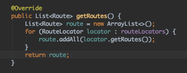
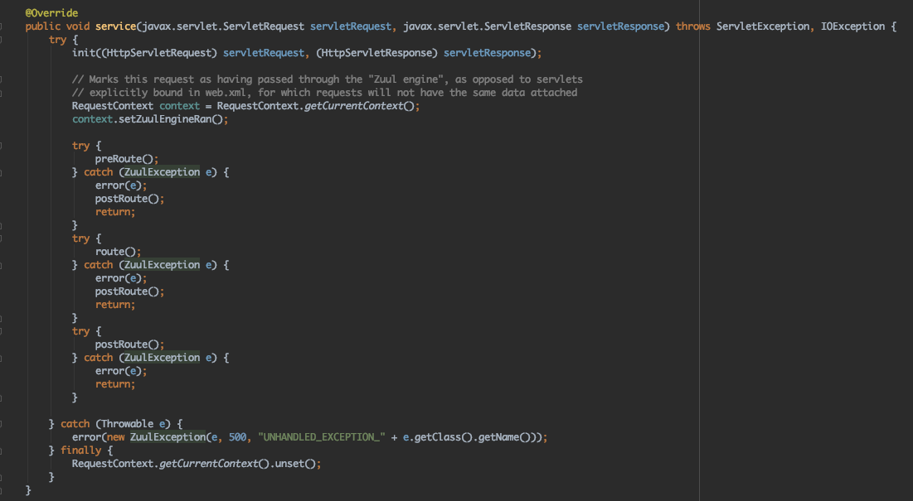
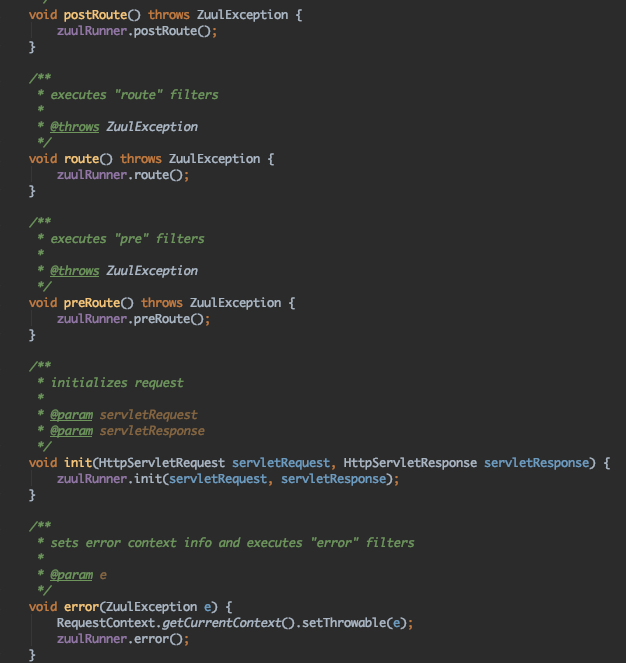
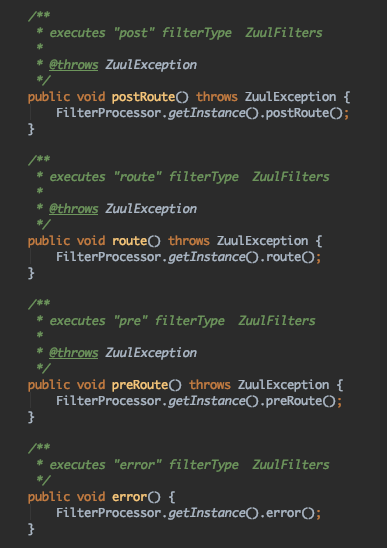

### ZuulServlet

- Request To Response flow (zuulServletPath로 들어오지않은 요청 + Tomcat기준 + GET요청)

**기본 플로우**
1. HttpServlet의 service()
2. FrameworkServlet의 service()
3. HttpServlet의 service()
4. FrameworkServlet의 doGet()
5. FrameworkServlet의 processRequest()
6. DispatcherServlet의 doService()
7. DispatcherServlet의 doDispatch()
8. HandlerMapping (기본 UrlHandlerMapping + ZuulHandlerMapping모두 탐색)의 lookupHandler() -> SimpleControllerHandlerAdapter의 handle()
9. ZuulController의 handleRequest()
10. ServletWrappingController의 handleRequestInternal()
11. ZuulServlet의 service()
12. ZuulRunner의 preRoute(), route(), postRoute()등이 호출
13. ZuulRunner의 각 메서드안에서는 FilterProcessor에게 요청을 위임
14. 요청이 성공했다면 SendResponseFilter에서 ServletOutputStream으로 응답을 write
15. CoyoteAdapter(service 메서드의 response.finishResponse()라인에서 클라이언트로 응답이 내려감)
> 필터 부분을 제외한 서블릿의 요청들이다. 모든 StackTrace들을 다 적어논 것은 아니고 큰 틀만 나열하였다. 각 번호를 기준으로 설명해 나가겠다.

**1 ~ 7번:**
 - Zuul을 사용하지 않았을 때에도 기본적으로 Spring에서 프론트 컨트롤러 패턴을 적용하여 요청을 처리하기 때문에 DispatcherServlet을 통해 요청을 처리한다.
 - DispatcherServlet은 FrameworkServlet을 상속받으며 FrameworkServlet은 HttpServlet을 상속받는 구조다.

**8번:** url 탐색 과정은 심플하다(위의 설명한대로 동작한다). 그전에 handling할 url이 등록되는 과정을 살펴보면 다음과 같다.
- Spring Context가 뜰 때, @RequestMapping으로 등록해놓은 url들이 (Controller 클래스들) AbstractHandlerMethodMapping의 detectHandlerMethods()를 통해 등록된다.
- ZuulHandlerMapping은 이 때 동작하지 않고 실제 Proxy or Route되어야 하는 요청이 들어올 때 RouteLocator를 통해 등록하게된다.
- 첫 요청시 ZuulHandlerMapping의 dirty필드가 true로 세팅되어있고 lookupHandler()에서 dirty필드가 true일때 resigterHandlers()를 통해 Proxy or Route에 필요한 정보들을 등록한다.
- API Gateway 유닛은 RefreshableRouteLocator을 구현한 SanctumRouteLocator를 만들어 사용하고 있으며, CompositeRouteLocator에서 RouteLocator를 구현한 Locator들을 모두 이용하여 Proxy or Route할 정보들을 등록한다.

- 위의 코드는 CompositeRouteLocator가 Route정보를 들고오는 메서드이다. for문을 보면 모든 RouteLocator를 통해 다 등록한다.
- url이 등록되면 SimpleControllerHandlerAdapter를 통해 요청을 처리할 handler를 호출한다. 그 핸들러가 9번의 ZuulController이다.

**9번:**
- ZuulController는 ServletWrappingController를 상속한 클래스이다.
- handleRequest()를 보면 별 다른 기능은 없고 finally 블럭에서 RequestContext를 unset해주는 역할만 있다. 이 역할을 빼고는 그냥 부모 클래스로 요청을 위임한다.
> ServletWrappingController는 Struts를 감싸기 위해서 일반적인 Spring web mvc 흐름을 가능한 그대로 사용하기 위해서 만들어낸 것이라 판단할 수 있다. Struts와 같은 서블릿 기반의 요청 처리 코드를 Spring web mvc에서 일관성있게 사용하기 위해 사용할 수 있음을 짐작 할 수 있다. ZuulServlet이 이용되기 좋은 클래스이다.

**10번:**
- ServletWrappingController의 handleRequestInternal()메서드는 서블릿의 service()를 호출하는데 여기서 호출되는 Servlet의 service()가 바로 ZuulServlet의 service()가 된다.

**11번:**
- ZuulServlet의 service의 코드를 보면 다음과 같다.

- 코드를 보면 세번의 try - catch문이 있고 error가 발생하면 SendErrorFilter를 태우고 postRoute()호출 후 바로 return한다.

**12번:**
- ZuulServlet의 각 xxRoute()는 ZuulRunner로 요청을 위임한다.

**13번:**
- ZuulRunner의 각 메서드안에서는 FilterProcessor에게 요청을 위임한다.

**14번:**
- 요청이 성공했다면 SendResponseFilter에서 ServletOutputStream으로 응답을 write한다. write만 할 뿐 아직 클라이언트에게 응답을 내려준 상태는 아니다.

**15번:**
- CoyoteAdapter의 service()에서 response.finishResponse()라인에서 클라이언트로 응답이 내려간다. 이 클래스는 embed tomcat을 이용할 때이고 undertow나 다른 http listener를 사용한다면 다를 수 있다.
